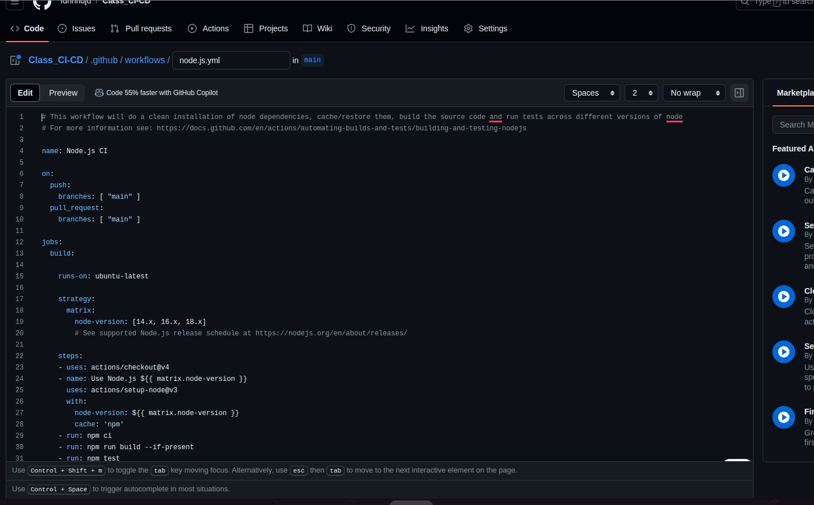

## I. Initializing the Express Application
```cmd
    git clone git@github.com:fdhhhdjd/Class_CI-CD.git
```

## II. Setting up Github and SSH
```cmd
    mkdir ~/.ssh

    cd ~/.ssh

    ssh-keygen -t rsa

    Enter file in which to save the key (/Users/baron/.ssh/id_rsa):

    Enter passphrase (empty for no passphrase):

    Your public key has been saved in /Users/baron/.ssh/id_rsa.pub

    The key fingerprint is:

    SHA256:<<RANDOM STRING OF CHARACTERS>>

    The key's random image is:

    +---[RSA 3072]----+
    |                 |
    |                 |
    |                 |
    |                 |
    |                 |
    |                 |
    |                 |
    |                 |
    |                 |
    +----[SHA256]-----+
```


## III. Push code on github

```cmd
    cd <<Development folder>>

    git add -A

    git commit -m "first commit"

    git push -u origin main -i ~/.ssh/id_rsa
```

## IV. Creation of Server and Connection to Github

## 1. Settings > actions > Runners > New self-hosted runners


## 2. Connect my VPS 
 - ssh shell-store
 - install NodeJs [curl -fsSL https://deb.nodesource.com/setup_20.x | sudo -E bash -](https://github.com/nodesource/distributions)
 - Check version: lsb_release -a
 - mkdir actions-runner && cd actions-runner
 - sudo RUNNER_ALLOW_RUNASROOT=true ./config.sh --url https://github.com/fdhhhdjd/Class_CI-CD --token ******
 - ./svc.sh install
 - ./svc.sh start

## 3. Create file CI




